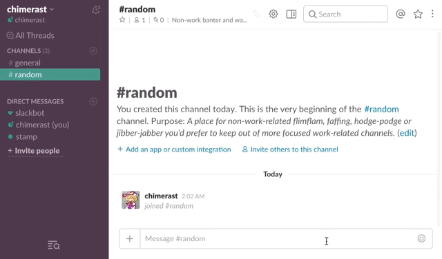

Slack Stamp Bot
====

"Slack Stamp Bot" enables stamping custom emoji on Slack.

## DEMO

## Usage

#### 1. Create Slack Bot

Go to https://my.slack.com/services/new/bot

Create bot and copy your bot's API Token.

#### 2. Deploy this program with bot user token

With setting environment variable `SLACK_API_TOKEN` to copied token,

Deploy to Heroku: 

or

Deploy to Docker: `docker pull chimerast/slack-stamp` ([Docker Hub Repository](https://hub.docker.com/r/chimerast/slack-stamp/))

or else.

#### 3. Create Slack Slash Command

Go to https://my.slack.com/services/new/slash-commands

Create slash command and set URL Setting to `http(s)://<HOSTNAME YOU DEPLOYED>/slack/receive`.

#### 4. Stamp It!

Enter `/stamp :sugoi:` on Slack (`/stamp` is your slash command). You got stamp!

## Note

If you would like to use stamps in private channel, please invite the bot to the channel.

You can't use stamps in direct message.

## License

[Apache-2.0](LICENSE)

## Author

[Hideyuki TAKEUCHI (@chimerast)](https://github.com/chimerast)

## Reference

- http://tech.grooves.com/entry/2017/04/04/122107
- https://github.com/ringogirl/slamp
